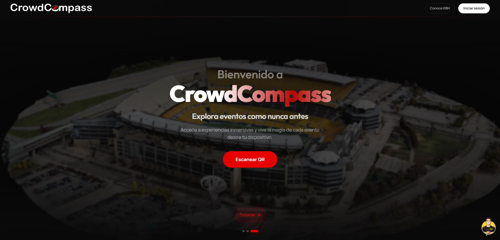
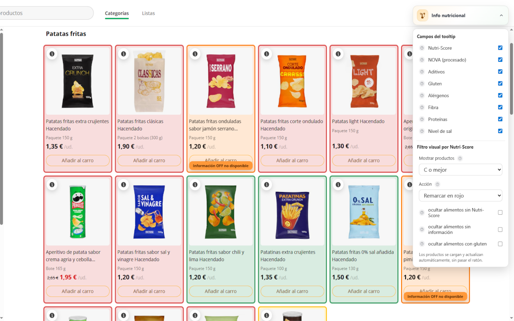

  
  

<h1 align="center">Adrián Vilella Espony</h1>

  <strong>Multimedia engineer · Software developer · Fullstack web</strong>

  I build web applications, interactive tools and digital experiences with a solid technical foundation and a polished presentation.

  
  

  <strong>Email:</strong> <a href="mailto:adrian.vilella.pro@gmail.com">adrian.vilella.pro@gmail.com</a>

---

## Professional Profile

I am a Multimedia Engineer graduated from the University of Alicante, specialised in software development and web technologies. My profile is mainly oriented towards frontend development, the area I enjoy the most and where I have developed a large part of my projects using technologies such as React, Angular, JavaScript, TypeScript, HTML and CSS.

At the same time, I have experience in fullstack development, working with technologies such as Node.js, Express, PostgreSQL, MySQL, Prisma and REST APIs. This allows me to work comfortably across the complete development of web applications, from user interfaces to server logic and database management.

During my studies and personal projects, I have participated in the development of applications focused on solving real problems, including management platforms, interactive tools and web applications with authentication, databases and online deployment.

I am currently continuing to expand my knowledge and develop projects focused on web applications, interactive software and modern development technologies.

---

## Core Stack

  
  
  
  
  
  
  
  
  
  
  
  
  
  
  
  

---

## Featured Projects

### WikiCodex

  

Web application for organising campaigns, characters, items, places, powers, spells and narrative content for tabletop role-playing games. WikiCodex combines data management, granular privacy and a visual interface designed to browse and maintain complex content with clarity.

  

  
  

- React frontend with a complete responsive interface.
- Node.js, Express, Prisma and PostgreSQL backend.
- Privacy, permissions, campaigns, versions and media management.
- Static public demo prepared to showcase the project without consuming production services.

### CrowdCompass

  

Web application for large events with interactive 3D orientation, indoor routes, ticket management, venues, seats and digital assistance to improve the attendee experience inside a venue.

  

  
  

- University ABP team project developed at the University of Alicante.
- Angular and TypeScript frontend with 3D visualisation using Three.js and WebGL.
- Node.js, Express, Sequelize, MySQL, JWT and Google OAuth backend.
- Management of events, venues, zones, seats, tickets, points of interest and indoor routes.

### Nutrivisor

  

Academic augmented-web project applied to online grocery shopping. Nutrivisor enriches the shopping experience with extended nutritional information, visual indicators and automatic filters over Mercadona products, combining data from the website itself with information from Open Food Facts.

  

  
  

- Functional Tampermonkey userscript for `tienda.mercadona.es`.
- Evolution towards a Chrome extension using Manifest V3 and Vite.
- Nutritional data lookup, Nutri-Score, NOVA, allergens, additives and composition.
- Automatic visual filters to support faster and more informed purchase decisions.

---

## How I Work

- I work comfortably in teams and I like collaborating in an organised way to move projects forward efficiently and coherently.

- I maintain a continuous learning mindset, exploring and learning new technologies, tools and methodologies that can bring value to projects.

- I am interested in understanding the architecture, behaviour and technical decisions behind each application, seeking to understand not only the “how”, but also the “why” behind every solution.

- I try to develop maintainable, structured and scalable code, paying attention to project organisation and clear documentation that supports future work and software evolution.

- I adapt easily to different types of projects, technologies and development environments, while keeping a practical mindset focused on continuous improvement.

---

## Contact

I am open to collaborating on web development, interactive applications, digital tools and multimedia experiences.

- Email: [adrian.vilella.pro@gmail.com](mailto:adrian.vilella.pro@gmail.com)
- LinkedIn: [Adrián Vilella Espony](https://www.linkedin.com/in/adri%C3%A1n-vilella-espony-40a046410)
- GitHub: [@adrianvilellapro](https://github.com/adrianvilellapro)
