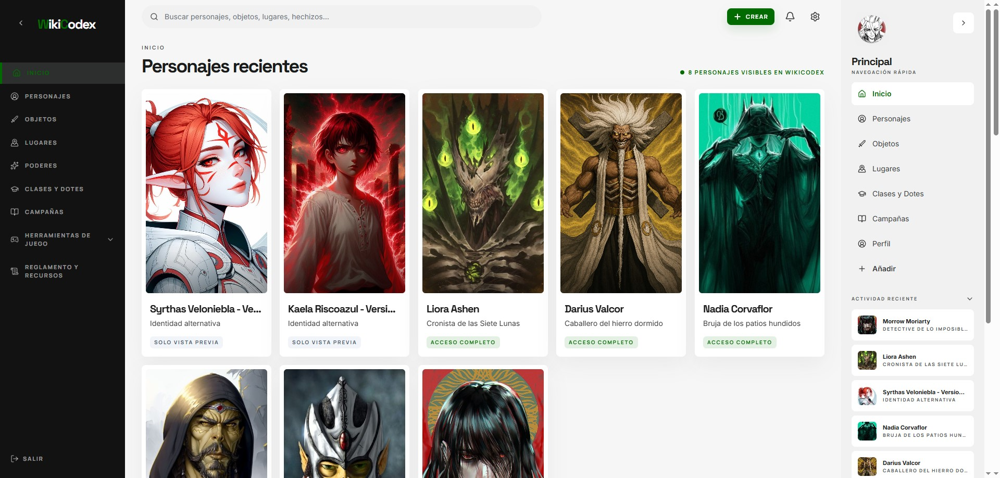

  
  

<h1 align="center">Adrián Vilella Espony</h1>

  <strong>Ingeniero multimedia · Desarrollador de software · Fullstack web</strong>

  Desarrollo aplicaciones web, herramientas interactivas y experiencias digitales con una base técnica sólida y una presentación cuidada.

  
  

  <strong>Email:</strong> <a href="mailto:adrian.vilella.pro@gmail.com">adrian.vilella.pro@gmail.com</a>

---

## Perfil profesional

Soy Ingeniero Multimedia graduado en la Universidad de Alicante, especializado en desarrollo de software y tecnologías web. Mi perfil está principalmente orientado al desarrollo frontend, área en la que más disfruto trabajando y en la que he desarrollado gran parte de mis proyectos utilizando tecnologías como React, Angular, JavaScript, TypeScript, HTML y CSS.

Al mismo tiempo, cuento con experiencia en desarrollo fullstack, trabajando con tecnologías como Node.js, Express, PostgreSQL, MySQL, Prisma y APIs REST, lo que me permite desenvolverme con soltura en el desarrollo completo de aplicaciones web, desde la interfaz de usuario hasta la lógica de servidor y la gestión de bases de datos.

Durante mi formación y en proyectos personales he participado en el desarrollo de aplicaciones orientadas a resolver problemas reales, incluyendo plataformas de gestión, herramientas interactivas y aplicaciones web con autenticación, bases de datos y despliegue online.

Actualmente continúo ampliando mis conocimientos y desarrollando proyectos centrados en aplicaciones web, software interactivo y tecnologías modernas de desarrollo.

---

## Stack principal

  
  
  
  
  
  
  
  
  
  
  
  
  
  
  
  

---

## Proyectos destacados

### WikiCodex

  

Aplicación web para organizar campañas, personajes, objetos, lugares, poderes, hechizos y contenido narrativo de partidas de rol. WikiCodex combina gestión de datos, privacidad granular y una interfaz visual pensada para consultar y mantener contenido complejo sin perder claridad.

  

  
  

- Frontend en React con una interfaz completa y responsive.
- Backend con Node.js, Express, Prisma y PostgreSQL.
- Gestión de privacidad, permisos, campañas, versiones y contenido multimedia.
- Demo estática pública preparada para enseñar el proyecto sin consumir servicios de producción.

### Nutrivisor

  

Proyecto académico de web aumentada aplicado al supermercado online. Nutrivisor enriquece la experiencia de compra con información nutricional ampliada, indicadores visuales y filtros automáticos sobre productos de Mercadona, integrando datos internos de la web con información procedente de Open Food Facts.

  

  
  

- Userscript funcional para Tampermonkey sobre `tienda.mercadona.es`.
- Evolución hacia extensión de Chrome con Manifest V3 y Vite.
- Consulta de datos nutricionales, Nutri-Score, NOVA, alérgenos, aditivos y composición.
- Filtros visuales automáticos para facilitar decisiones de compra más informadas.

---

## Cómo trabajo

- Trabajo cómodamente en equipo y me gusta colaborar de forma organizada para sacar adelante proyectos de manera eficiente y coordinada.

- Mantengo una actitud de aprendizaje continuo, explorando y aprendiendo nuevas tecnologías, herramientas y metodologías que puedan aportar valor a los proyectos.

- Me interesa comprender la arquitectura, el funcionamiento y las decisiones técnicas detrás de cada aplicación, buscando entender no solo el “cómo”, sino también el “por qué” de cada solución.

- Intento desarrollar código mantenible, estructurado y escalable, prestando atención a la organización del proyecto y a una documentación clara que facilite el trabajo y la evolución futura del software.

- Me adapto con facilidad a distintos tipos de proyectos, tecnologías y entornos de desarrollo, manteniendo siempre una mentalidad práctica y orientada a la mejora continua.

---

## Contacto

Estoy abierto a colaborar en proyectos de desarrollo web, aplicaciones interactivas, herramientas digitales y experiencias multimedia.

- Email: [adrian.vilella.pro@gmail.com](mailto:adrian.vilella.pro@gmail.com)
- LinkedIn: [Adrián Vilella Espony](https://www.linkedin.com/in/adri%C3%A1n-vilella-espony-40a046410)
- GitHub: [@adrianvilellapro](https://github.com/adrianvilellapro)
